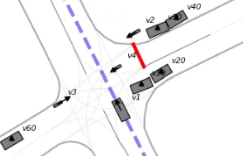

# EURO NCAP Crash Avoidance Scenarios

Copyright © 2026, University of Waterloo. All rights reserved.

2026 Euro NCAP crash avoidance scenarios modeled using [GeoScenario 2](https://geoscenario2.readthedocs.io/).
The scenarios can be executed using [GeoScenario Server](https://uwaterloo.ca/waterloo-intelligent-systems-engineering-lab/projects/geoscenario-server/) traffic simulator.

For example, in the screenshot below, the vehicle under test (VUT) `v1` is driving forward across the intersection while occluding vehicles are blocking the view of three bicycles (`v2`, `v3`, and `v4`) entering the intersection. The bicycles adjust their speeds to force a collision with the VUT.

Click on the image to watch the video of the scenario execution.

[](scenario_suite/scenarios/NCAP_CBC/NCAP_CBC-slaunch-NCAP_CBC-right_pb2-left_pb3-right_pb4-occluding_pv10_pv20-occluding_pv30_pv40-occluding_pv50_pv60-vut_pv10.mp4)

All example scenario runs shown in videos in this repository use a "path vehicle" VUT in order to show the collisions.
However, for testing an actual automated driving system, the scenarios can be launched with an "external vehicle" VUT, that is, a vehicle controlled by an external system via, for example, ROS2.


**Contributors**

* [Michał Antkiewicz](https://uwaterloo.ca/waterloo-intelligent-systems-engineering-lab/profiles/michal-antkiewicz)
* [Shourrya Guha](https://uwaterloo.ca/waterloo-intelligent-systems-engineering-lab/contacts/shourrya-guha)
* [Charlie Zheng](https://uwaterloo.ca/waterloo-intelligent-systems-engineering-lab/contacts/charlie-zheng)


# Scenarios

For the detailed description of the scenarios and videos of example runs, see [scenario_suite/README.md](scenario_suite/README.md).

# Installation

## Installing a self-containded binary for any Linux OS (`amd64` only)

Install GeoScenario Server to `/opt/geoscenarioserver`.

1. Ensure `curl`, `tar`, and `zstd` are available.
2. Execute
```bash
curl -fsSL https://wiselab.uwaterloo.ca/wise-sim/opt-geoscenarioserver-install.bash | sudo bash
```

**NOTE**: if you have write access to `/opt`, you can omit `sudo`.

**NOTE**: GeoScenario Server must be installed to `/opt/geoscenarioserver` because it is a conda environment which are not relocatable.
It contains both the standalone and ROS2 server versions.

# Usage

0. Obtain the scenario suite

Either clone the repository:
```bash
git clone https://github.com/wiselabuw/euro-ncap-crash-avoidance-scenarios/
```
Or download a compressed archive from the [GitHub Releases](https://github.com/wiselabuw/euro-ncap-crash-avoidance-scenarios/releases) page and extract it.

1. change to and source the scenario suite (provides the command `slaunch` and allows launching scenarios from any working directory):
```bash
cd euro-ncap-crash-avoidance-scenarios/scenario_suite
source setup.bash
```

2. Launch a scenario called `<scenario_name>` and, optionally, a number of scenario parts `<part_name>.osm*`.
A list of `[<gss_options>*]`, such as, `--no-dash`, can be optionally provided as well.
Part names and GSS options can be intermixed.
The `slaunch` command provides autocompletion for scenario names, part names, and GSS options by pressing `<TAB>` key.
Pressing the `<TAB>` key twice shows the list of available options that complete the provided previx.

```bash
slaunch

Usage: slaunch <scenario_name> [<part_name>.osm*] [--ros] [<gss_options>*]

Launches the specified scenario with the GeoScenarioServer traffic simulator

Arguments:
     <scenario_name>      name of the folder 'scenarios/<scenario_name>' (mandatory)
     [<part_name>.osm*]   names of the files in the folder 'scenarios/<scenario_name>/parts' (optional list)
     [--ros]              launch ROS2 node geoscenario_server (launch standalone by default)
     [<gss_options>*]     additional options for the GeoScenarioServer (optional list):
                          --no-dash --wait-for-input --wait-for-client --dash-pos --debug --file-log
...
```
for example, launch a standalone simulation
```bash
slaunch NCAP_CPC \                      # base secenario
        occluding_pv30_pv40.osm \       # 3 parts
        right_pp2.osm \
        left_pp3.osm \
        --dash-pos 0 0 960 1080  \      # GSS option
        --wait-for-input \              # other GSS options
        --file-log \
        vut_pv30.osm                    # VUT with speed profile pv30
```
Copy and paste a single line version of the above command:
```bash
slaunch NCAP_CPC occluding_pv30_pv40.osm right_pp2.osm left_pp3.osm --dash-pos 0 0 960 1080  --wait-for-input --file-log vut_pv30.osm
```

for example, launch the native ROS2 server with a co-simulator
```bash
slaunch NCAP_CPC \                      # base secenario
        occluding_pv30_pv40.osm \       # 3 parts
        right_pp2.osm \
        left_pp3.osm \
        --ros \                         # start the native ROS2 server
        --no-dash \                     # other GSS options
        vut_pv30.osm                    # VUT with speed profile pv30
```
Copy and paste a single line version of the above command:
```bash
slaunch NCAP_CPC occluding_pv30_pv40.osm right_pp2.osm left_pp3.osm --ros --no-dash vut_pv30.osm
```

Each scenario may optionally contain a subfolder `parts`, which contains the available scenario fragments. For example, 
```
└── NCAP_CPC
    ├── NCAP_CPC.osm                    # base scenario: VUT driving forward across the intersection
    └── parts                           # scenario fragments
        ├── left_pp3.osm                # path pedestrian pp3 entering from the left of VUT
        ├── occluding_pv30_pv40.osm     # occluding vehicles pv30 and pv40 before the crosswalk
        ├── right_pp2.osm               # path pedestrian pp2 entering from the right of VUT
        ├── vut_ev.osm                  # external vehicle under test (VUT)
        ├── vut_pv10.osm                # path vehicle under test (VUT) with different speed profiles
        ├── vut_pv20.osm
        ├── vut_pv30.osm
        ├── vut_pv40.osm
        ├── vut_pv50.osm
        └── vut_pv60.osm

```

NOTE: scenario fragments cannot be run individually without a base scenario because they are missing the required elements `origin` and `globalconfig`.

3. Review the scenario execution outputs

Every scenario execution creates a folder with various log files in 
```
scenario_suite/logs/<date>-<time>/
```
For example, 
```
scenario_suite/logs/2026-03-16-172646/
├── gss_output.log       # console output
├── launch_command.log   # command used to launch the simulation 
├── launch_params.yaml   # (ROS2 only) launch command parameters
└── violations.json      # report of collisions, timeouts, and other events
```

For ROS2, the `launch_params.yaml` is used to provide values of parameters to `ros2 run` command.
